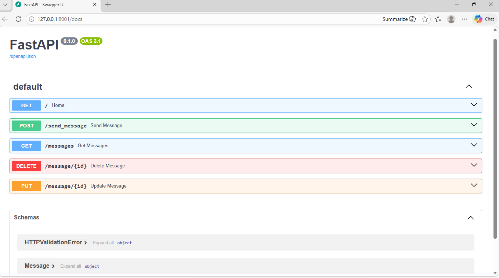

# FastAPI Messaging API

A simple REST API built using **FastAPI** and **MongoDB** that allows users to send, retrieve, update, and delete messages.

---

## Tech Stack

- Python
- FastAPI
- MongoDB
- Uvicorn

---

## Features

- Send a message
- Get all messages
- Update a message
- Delete a message

---

## Project Structure

```
fastapi-messaging_api
│
├── main.py
├── routes.py
├── models.py
├── database.py
├── README.md
├── .gitignore
```

---

## Installation

Clone the repository

```
git clone https://github.com/vinayprasath/fastapi-messaging_api.git
```

Move into the project folder

```
cd fastapi-messaging_api
```

Install dependencies

```
pip install fastapi uvicorn pymongo
```

Run the server

```
uvicorn main:app --reload --port 8001
```

---

## API Endpoints

### Send Message
POST /message

### Get Messages
GET /messages

### Update Message
PUT /message/{id}

### Delete Message
DELETE /message/{id}

---

## API Documentation

FastAPI automatically provides interactive documentation.

## API Documentation



Open in browser:

```
http://localhost:8001/docs
```

---

## Author

Vinay Prasath  
B.Tech Artificial Intelligence & Data Science
